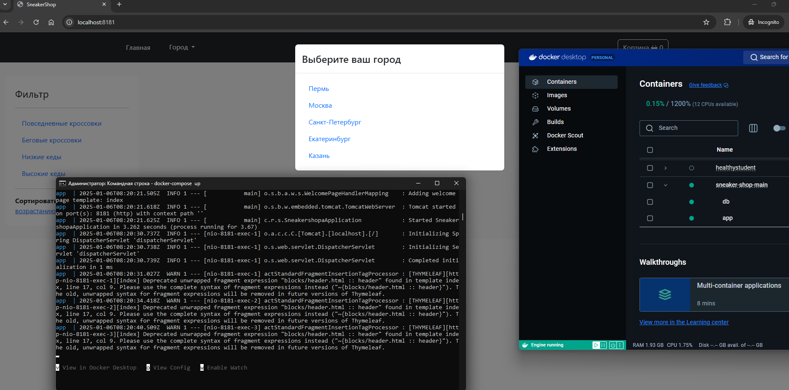

# Лабораторная работа №1
## Реализация запуска приложения с использованием Docker

### Содержание

[1. Постановка задачи](#task)

[2. Решение](#implementation)

[3. Выводы](#conclusion)

## <a id="task" style="color: lightgrey">1. Постановка задачи

- #### Пройти interactive tutorial по Docker
- #### Создать веб-сервис
- #### Создать Dockerfile и запустить приложение в Docker
- #### Создать docker-compose.yaml и запустить несколько контейнеров с использованием docker-compose


## <a id="implementation" style="color: lightgrey">2. Решение</a>

Для работы было использовано веб-приложение, разработанное мной ранее.

Перед запуском приложения в Docker необходимо было создать Dockerfile с инструкцией по созданию образа:

```Dockerfile
FROM openjdk:21
ARG JAR_FILE=target/*.jar
COPY ${JAR_FILE} app.jar
ENTRYPOINT ["java", "-jar", "app.jar"]
```

Далее были использованы следующие команды:

- **сборка JAR файла**

```cmd
mvn clean package
```

- **создание Docker Image**

```cmd
docker build -t sneakershopa .
```

Чтобы запустить приложение в нескольких контейнерах необходимо было создать файл docker-compose.yml.

Было решено создать два контейнера:
1. Контейнер с бэкендом
2. Контейнер с базой данных

Следующий файл был получен:

```yml
services:
  app:
    image: 'sneakershopa:latest'
    container_name: app
    build:
      context: .
      dockerfile: Dockerfile
    ports:
      - "8181:8181"
    depends_on:
      - db
    environment:
      - SERVER_PORT= 8181
      - SPRING_DATASOURCE_URL=jdbc:postgresql://db:5432/sneakershop
      - SPRING_DATASOURCE_USERNAME=postgres
      - SPRING_DATASOURCE_PASSWORD=870125
      - SPRING_JPA_HIBERNATE_DDL_AUTO=update

  db:
    image: 'postgres:17.0'
    container_name: db
    environment:
      - POSTGRES_DB=sneakershop
      - POSTGRES_USER=postgres
      - POSTGRES_PASSWORD=870125
    volumes:
      - ./create_db.sql:/docker-entrypoint-initdb.d/create_db.sql
      - db-data:/var/lib/postgresql/data
    restart: unless-stopped

volumes:
  db-data:
```

После этого были использованы следующие команды:

- **сборка проекта**

```cmd
docker-compose build
```

- **запуск проекта**

```cmd
docker-compose up
```

- **остановка проекта**

```cmd
docker-compose down
```

## <a id="conclusion" style="color: lightgrey">3. Выводы</a>
В результате работы проект был запущен в нескольких контейнерах с помощью Docker Compose
