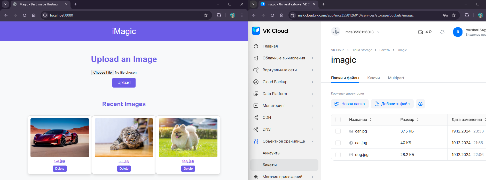

# Лабораторная работа №2
## Реализация веб-приложение с использованием протокола S3

### Содержание

[1. Постановка задачи](#task)

[2. Решение](#implementation)

[3. Выводы](#conclusion)

## <a id="task" style="color: lightgrey">1. Постановка задачи

- #### Создать ресурс, поддерживающий протокол S3 у любого облачного провайдера
- #### Реализовать веб-приложение, которое позволяет работать с данными в bucket: создавать, удалять, просматривать данные в bucket


## <a id="implementation" style="color: lightgrey">2. Решение</a>

Для работы было решено создать приложение для загрузки и хранения изображений в бакете.

Перед началом работы с проектом необходимо было установить дополнительные зависимости для использования протокола S3:

```xml
<dependency>
    <groupId>io.awspring.cloud</groupId>
    <artifactId>spring-cloud-aws-starter-s3</artifactId>
    <version>3.2.1</version>
</dependency>

<dependency>
<groupId>software.amazon.awssdk</groupId>
<artifactId>s3-transfer-manager</artifactId>
<version>2.29.21</version>
</dependency>

<dependency>
<groupId>software.amazon.awssdk.crt</groupId>
<artifactId>aws-crt</artifactId>
<version>0.33.2</version>
</dependency>
```

В качестве облачного провайдера был выбран сервис VK Cloud. Перед созданием приложения были созданы токены доступа и сам бакет.

Данные для доступа к нему были записаны в конфигурационном файле:

```properties
spring.application.name=imagic-spring-aws

spring.cloud.aws.endpoint=https://hb.ru-msk.vkcloud-storage.ru
spring.cloud.aws.region.static=ru-msk
spring.cloud.aws.credentials.access-key=dbncoKwkdfF3rAJ47Kpshi
spring.cloud.aws.credentials.secret-key=6z5d3aLq13DEfAWkqcBK7GuS2H4ihnvok3NkwmJnPiPU
bucket-name=imagic
```

Для взаимодействия с бакетом был создан класс ImageService, содержащий следующие методы:

- **getListFiles - получение списка файлов**

```java
public List<String> getListFiles() {
        var request = ListObjectsV2Request
        .builder()
        .bucket(this.bucketName)
        .build();
        var response = this.client.listObjectsV2Paginator(request);

        return response
        .stream()
        .map(ListObjectsV2Response::contents)
        .flatMap(List::stream)
        .map(S3Object::key)
        .toList();
}
```

- **getFile - получение файла**

```java
public ByteArrayResource getFile(String key) throws IOException {
        var request = GetObjectRequest
        .builder()
        .bucket(this.bucketName)
        .key(key)
        .build();

        var responseInputStream = client.getObject(request);

        return new ByteArrayResource(IoUtils.toByteArray(responseInputStream)) {
@Override
public String getFilename() {
        return key;
        }
        };
}
```

- **uploadFile - загрузка файла в бакет**

```java
public void uploadFile(MultipartFile file) throws IOException {
        var request = PutObjectRequest.builder()
        .bucket(this.bucketName)
        .key(file.getOriginalFilename())
        .build();

        this.client.putObject(request, RequestBody.fromBytes(file.getBytes()));
}
```

- **uploadFile - удаление файла из бакета**

```java
public void deleteFile(String fileName) {
        var request = DeleteObjectRequest.builder()
        .bucket(this.bucketName)
        .key(fileName)
        .build();

        this.client.deleteObject(request);
}
```

После этого был реализован контроллер ImagesController, использующий методы:

- **welcomePage - отображение главной страницы со списком файлов в бакете**

```java
@GetMapping("/")
public String welcomePage(Model model) {
        List<String> imagesList = this.imageService.getListFiles();
        model.addAttribute("images", imagesList);
        return "index";
        }
```

- **getListFiles - получение списка файлов**

```java
@GetMapping("/files")
public ResponseEntity<List<String>> getListFiles() {
        return ResponseEntity.ok(this.imageService.getListFiles());
        }
```

- **getFile - отображение файла**

```java
@GetMapping("{fileName}")
public ResponseEntity<Resource> getFile(@PathVariable("fileName") String fileName) throws IOException {
        var byteArray = this.imageService.getFile(fileName);

        var headers = new HttpHeaders();
        headers.add(
        HttpHeaders.CONTENT_DISPOSITION,
        String.format("attachment; filename=\"%s\"", fileName)
        );

        return ResponseEntity.ok()
        .headers(headers)
        .contentLength(byteArray.contentLength())
        .contentType(MediaType.APPLICATION_OCTET_STREAM)
        .body(byteArray);
        }
```

- **deleteFile - удаление файла**

```java
@GetMapping("/delete/{fileName}")
public String deleteFile(@PathVariable("fileName") String fileName) {
        this.imageService.deleteFile(fileName);

        return "redirect:/";
        }
```

- **uploadFile - загрузка файла**

```java
@PostMapping("/upload")
public String uploadFile(@RequestParam("image") MultipartFile file) throws IOException {
        this.imageService.uploadFile(file);

        return "redirect:/";
        }
```

Для шаблонизации был использован Thymeleaf.

## <a id="conclusion" style="color: lightgrey">3. Выводы</a>
Было создано веб-приложение для загрузки и хранения изображений в бакете с использованием протокола S3. При этом были реализованы функции просмотра, загрузки и удаления файлов.
