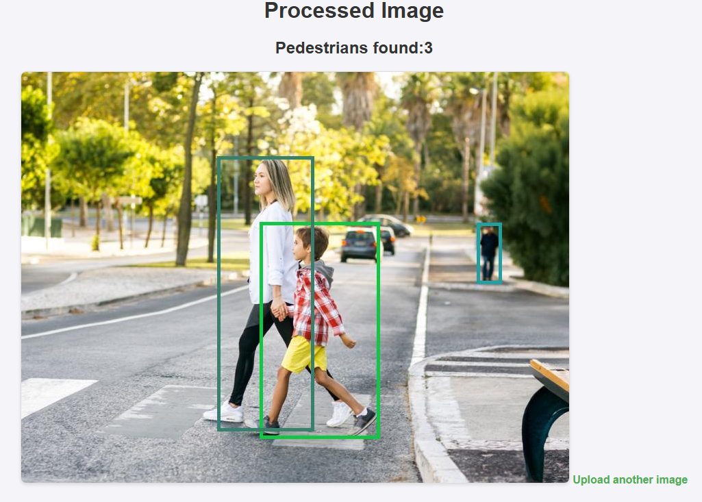

# Лабораторная работа №3
## Реализация веб-приложения с технологий computer vision

### Содержание

[1. Постановка задачи](#task)

[2. Решение](#implementation)

[3. Выводы](#conclusion)

## <a id="task" style="color: lightgrey">1. Постановка задачи
Для реализации данной лабораторной работы требуется создать веб-приложение, позволяющее:
- #### Загрузить изображение
- #### Отобразить информацию о находящихся объектах на изображении


## <a id="implementation" style="color: lightgrey">2. Решение</a>

Для работы было решено создать приложение для загрузки изображений и отображения информации о объектах на них.

Чтобы реализовать функционал computer vision был выбран сервис VK Cloud Vision, имеющий API.

Для взаимодействия с ним был создан контроллер ImagesController, использующий методы:

- **home - отображение главной страницы с полем загрузки изображения**

```java
@GetMapping("/")
public String home() {
        return "index";
        }
```

- **processImage - обработка изображения и возвращение страницы с резултатом**

```java
@PostMapping("/process")
public String processImage(@RequestParam("file") MultipartFile file, Model model) throws IOException {
        if (file.isEmpty()) {
        model.addAttribute("error", "Please upload a valid image file.");
        return "upload";
        }
        detectedObjects objects = this.detectOnImage(file);
        var image = this.drawDetect(file, objects.getObjects());
        String base64Image = java.util.Base64.getEncoder().encodeToString(image);
        model.addAttribute("image", base64Image);
        model.addAttribute("count", objects.getCount());
        return "result";
        }
```

- **detectOnImage - отправка запроса к API Vision, получение и обработка ответа**

```java
private detectedObjects detectOnImage(MultipartFile file) throws IOException {
        HttpHeaders headers = new HttpHeaders();
        headers.setContentType(MediaType.MULTIPART_FORM_DATA);
        headers.setAccept(Collections.singletonList(MediaType.APPLICATION_JSON));

        MultiValueMap<String, Object> body = new LinkedMultiValueMap<>();
        ByteArrayResource fileAsResource = new ByteArrayResource(file.getBytes()) {
@Override
public String getFilename() {
        return file.getOriginalFilename();
        }
        };
        body.add("file", fileAsResource);
        body.add("meta", meta);

        HttpEntity<MultiValueMap<String, Object>> requestEntity = new HttpEntity<>(body, headers);
        var response = restTemplate.postForEntity(
        apiUrl + "/api/v1/objects/detect?oauth_token=" + apiKey+"&oauth_provider=mcs",
        requestEntity,
        String.class
        );
                System.out.println(response.getBody());
                var node = objectMapper.readTree(response.getBody());
                var detectedData = node
                .get("body")
                .get("pedestrian_labels")
                .get(0)
                .get("labels");
                var countData = node
                .get("body")
                .get("pedestrian_labels")
                .get(0)
                .get("count_by_density");

                var data = objectMapper.treeToValue(detectedData, Detected[].class);
        var count = objectMapper.treeToValue(countData, Integer.class);

        return new detectedObjects(data, count);

        }
```

- **drawDetect - добавление границ объектов на изображение по координатам**

```java
private byte[] drawDetect(MultipartFile file, Detected[] objectsArr) throws IOException {
        var image = ImageIO.read(file.getInputStream());
        var graphics = image.createGraphics();
        graphics.setStroke(stroke);
        for (int i = 0; i < objectsArr.length; i++) {
        graphics.setColor(randomColor());
        List<Integer> measures = objectsArr[i].coordination();
        graphics.drawRect(
        measures.get(0),
        measures.get(1),
        measures.get(2)-measures.get(0),
        measures.get(3)-measures.get(1)
        );
        }
        graphics.dispose();

        var outputStream = new ByteArrayOutputStream();
        ImageIO.write(image, "jpg", outputStream);

        return outputStream.toByteArray();
        }
```

Для шаблонизации был использован Thymeleaf.

## <a id="conclusion" style="color: lightgrey">3. Выводы</a>
В результате выполнения работы было разработано веб-приложение, для загрузки изображений и нахождения объектов на них, а именно людей.
